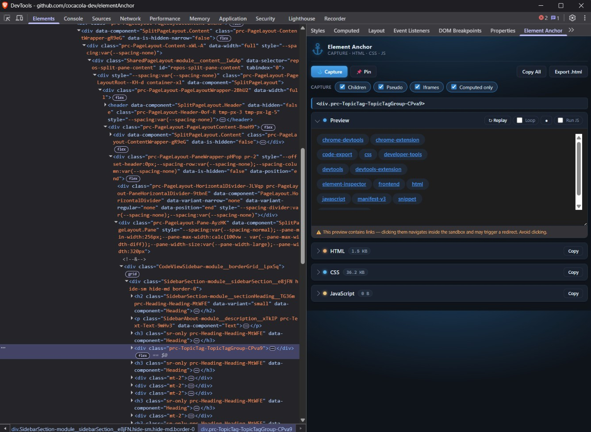

# ⚓ Element Anchor

A Chrome DevTools extension that anchors into any element and pulls its **HTML**, **CSS** (including pseudo-elements and matched rules) and **JavaScript** back out — iframes included.

Select an element in the **Elements** panel and Element Anchor captures a clean, self-contained snapshot you can copy or export as a standalone `.html` file.

## Features

- **One-click capture** of the selected element — auto-captures as you move through the Elements tree.
- **Scoped CSS** — collects only the rules that actually match the captured subtree (not whole stylesheets), including `::before` / `::after` / `::marker` pseudo-elements.
- **Iframe traversal** — reaches into same-origin iframes and captures their matched styles and scripts too.
- **Computed-styles-only mode** for when you'd rather have the resolved values.
- **Pin** to freeze the current capture so navigating the DOM doesn't overwrite it.
- **Copy** each section individually, **Copy All**, or **Export** a ready-to-open `.html` file.
- Auto-matches your **DevTools light/dark theme**.

## Install (unpacked)

1. Open `chrome://extensions`.
2. Enable **Developer mode** (top-right).
3. Click **Load unpacked** and select this folder.

## Usage

1. Open **DevTools** (`F12` or `Ctrl+Shift+I`) on any page.
2. Go to the **Elements** tab and click the element you want to capture.
3. Open the **Element Anchor** pane on the right (click the `»` overflow arrow if it's hidden).
4. It captures automatically — the **HTML**, **CSS** and **JavaScript** appear in collapsible sections.
5. Use **Copy** on any section, **Copy All**, or **Export .html** to save a standalone file. Hit **📌 Pin** to freeze the current capture while you keep browsing the DOM.

## Files

| File | Role |
| --- | --- |
| `manifest.json` | Extension manifest (MV3) |
| `devtools.html` / `devtools.js` | Registers the DevTools sidebar pane |
| `panel.html` / `panel.js` | The panel UI and its logic |
| `extractor.js` | Injected into the page to extract HTML/CSS/JS |
| `icons/` | Extension icons |

## License

[MIT](LICENSE) © 2026 cocacola-dev — free to use, modify, and distribute for personal **and** commercial projects.

> Note: the source code is MIT. The anchor icon is Twemoji, licensed separately under CC-BY 4.0 (see Credits below).

## Credits

The anchor icon is adapted (resized) from **Twemoji**:

- Graphic: `2693.svg` (⚓ anchor)
- Author: Copyright 2020 Twitter, Inc. and other contributors — https://github.com/twitter/twemoji
- License: [CC-BY 4.0](https://creativecommons.org/licenses/by/4.0/)
